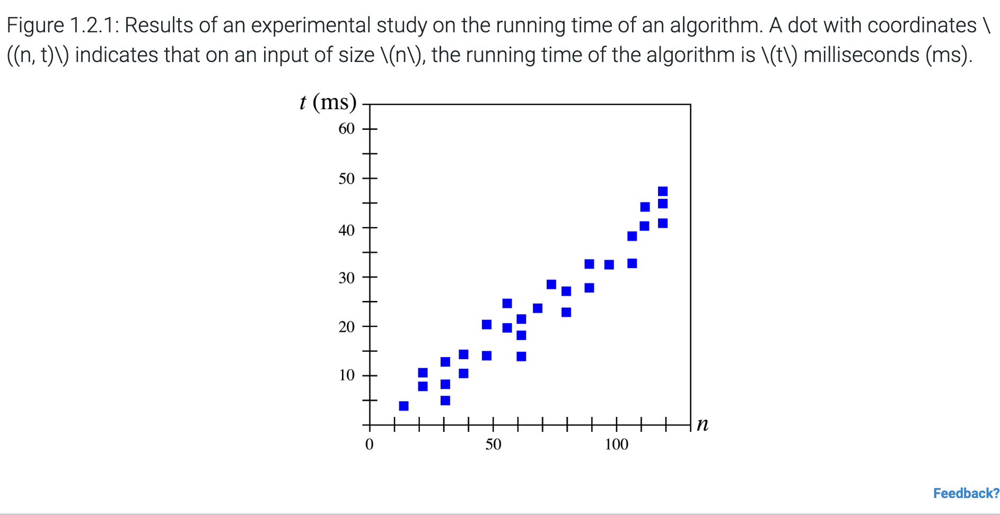

## Introduction

- **Scalability**: Refers to the ability of a system to gracefully accommodate growing sizes of inputs or amounts of workload.
- **Algorithm**: A step-by-step procedure for performing a task in a finite amount of time.
- **Data Structure**: A systematic way of organizing and accessing data.
- **Primary Analysis Tool**: 
  - Used to characterize the **running time** of an algorithm or data structure operation.
  - **Space usage** is also of interest.

### Key Considerations:
- **Running Time**: 
  - A natural measure for scalability, as time is a precious resource.
  - Crucial in economic and scientific applications because computer applications are expected to run as fast as possible.

---

## Analyzing Algorithms

The **running time** of an algorithm or data structure operation depends on several factors. So, how do we measure it properly? 

If the algorithm is already implemented, we can test it by running it with different input sizes and recording the time it takes to complete each run. We can use built-in tools in the programming language or operating system to measure this time accurately.

The goal is to see how the running time changes as the size of the input grows. To do this:
1. Test the algorithm with many different input sizes.
2. Record the results.
3. Plot the results on a graph:
   - The **x-axis** represents the input size (`n`).
   - The **y-axis** represents the running time (`t`).

This gives us a visual way to understand the relationship between input size and running time. To make this analysis meaningful, we need to choose good sample inputs and test enough of them to draw reliable conclusions about the algorithm's behavior.

It is important to note that the running time of an algorithm or data structure method increases with the input size, although it may also vary for distinct inputs of the same size. Also, the running time is affected by the hardware environment (processor, clock rate, memory, disk, etc.) and software environment (operating system, programming language, compiler, interpreter, etc.) in which the algorithm is implemented, compiled, and executed.

### Requirements for a general analysis methodology

Even though studying how fast algorithms run by testing them is helpful, it has some **problems** such as:

1. **Limited Inputs**:  
   - You can only test an algorithm on a few examples, so the test cases need to be chosen carefully to represent different situations.

2. **Different Systems**:  
   - Comparing two algorithms is hard unless they are tested on the exact same computer and software setup.

3. **Need to Code and Test**:  
   - To test an algorithm this way, you have to write the code and run it, which takes time.

Because of these issues, testing alone isn’t enough. We also need a way to **analyze algorithms** that:

1. Looks at **all possible inputs**, not just a few examples.  
2. Compares two algorithms **without depending on the computer or software** used.  
3. Lets us study the algorithm’s design **without writing or running any code**.  

#### Check Your Understanding:

1. An experimental study requires implementing and running the algorithm.
- True
- False
2. An experimental study could test all possible inputs for an algorithm that concatenates two strings.
- True
- False
3. An experimental study does 1,000,000 runs of an algorithm. Each is done in less than 5 milliseconds, implying that the algorithm is very fast for practical use.
- True
- False

[Answers](#Answers)

#### Pseudocode

---

## Answers

1. **True**: An algorithm must be implemented to be run, and must be run to be timed. So an experimental study requires both implementing and running the algorithm.
2. **False**: A string's length has no limit, so all possible pairs of strings cannot be generated. Thus all possible inputs cannot be tested by an experimental study.
3. **False**:  The high number of runs and low runtime of each isn't enough to conclude that the algorithm is fast for practical use. Perhaps an input that wasn't used makes the algorithm take 900 milliseconds. Or maybe the computer running the tests is much faster than the average computer.